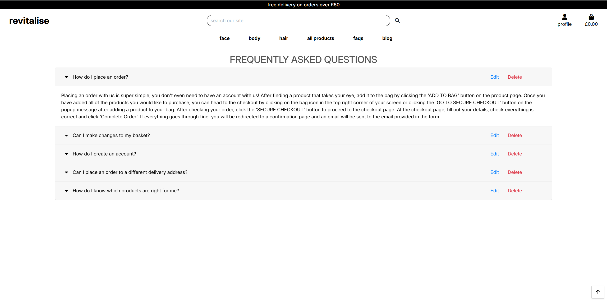
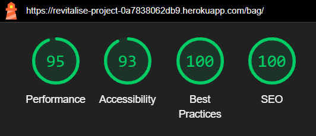

# Milestone Project 4 - Revitalise

Responsive image goes here

## Live Site

The live site for this project can be found at this link:

## GitHub Repository

The GitHub Repository for this project can be found at this link: <https://github.com/99bjacko/milestone-project-4>

## Objective and Initial Concept

In this project, I intend to create an e-commerce site selling cosmetic products, focusing on skincare. The goal of this website is to become a one-stop shop where users can learn about how to care for their skin and also buy products that are proven to keep skin healthy and protected. The main objective is to demonstrate my capabilities using HTML, CSS, JavaScript, and Python with Django along with using relational databases, Stripe payments, and Bootstrap.

The target audience for this website is people who are looking to get into skincare but aren't sure where to start, but this site is also suitable for people who have experience with skincare that are looking to purchase some of the most effective products out there.

## UX

### User Stories

- As a visitor to the website, I want the navigation between pages and/or areas to be easy and intuitive, not having to rely on browser buttons.
- As a visitor to the website, I want the website to be responsive on a number of different devices.
- As a new visitor to the website, I would like the home page to be visually appealing.
- As a new visitor to the website, I want to be able to see a wide range of products.
- As a new visitor to the website, I want to be able to register for an account easily.
- As a new visitor to the website, I would like to make purchases without having to register an account.
- As a visitor to the website, I want there to be an appropriate amount of information about each product.
- As a visitor to the website, I want the checkout process to be smooth and straightforward.
- As a visitor to the website, I want to be able to see exactly what I'm purchasing before completing the checkout process.
- As a visitor to the website, I want to be able to search for specific products and find them easily.
- As a visitor to the website, I want to be able to sort products via price or other parameters.
- As a visitor to the website, I want to be able to view specific product categories and the products that fall under those categories.
- As a returning visitor to the website, I want to be able to log in easily.
- As a returning visitor to the website, I want to be able to log out easily.
- As a returning visitor to the website, I would like to edit the information stored on my profile easily.
- As a returning visitor to the website, I would like to see my previous orders.
- As a site administrator, I would like to be able to add new products.
- As a site administrator, I would like to be able to edit existing products.
- As a site administrator, I would like to be able to delete existing products.
- As a site administrator, I would like to be able to add content such as faqs and blog posts.
- As a site administrator, I would like to be able to edit existing content such as faqs and blog posts.
- As a site administrator, I would like to be able to delete existing content such as faqs and blog posts.

#### Wireframes

For initially designing the project, I utilised Balsamiq to product wireframes. This step allows for planning layouts and page structures, allowing to focus more on the website looking like the designs, instead of trying to simultaneously code and design.

##### Home

##### Sign In

##### Sign Out

##### Profile

##### Products

##### Product Details

##### Bag

##### Checkout

##### Order Confirmation

##### FAQs

##### Blog

#### Colour Scheme

The colour scheme for this project was based around simplicity, to make the aesthetic both simple but appealing, allowing the focus to be on the products and the content, rather than the other aspects around them.
The majority of the website is built around black or grey text on a white background, with use of greys and colours taken from Bootstrap throughout the site where appropriate.

#### Typography

The 'Inter' typeface was chosen for this project and was picked using Google Fonts.

## Features

### Current Features

#### Navigation bar

- The design of the navigation bar is kept consistent across all pages of the website, with the logo on the left hand side, main navigation links and search in the center and profile and bag links on the right.
- On mobile, the main navigation links are contained in a collapsed menu with a navigation toggler, with an additional home link as the logo is hidden.
- There is a delivery banner at the top of the screen promoting free delivery if a customer spends over £50.
- The navigation bar is the main method for navigation around the different pages of the website.
- The main navigation links do not changed whether a user is logged in or not, or if the user is a superuser.
- There are additional links shown to superusers under the profile links to add products, faq posts, and blog posts.

##### Navigation Desktop

##### Navigation Mobile

#### Home Page

- The home page contains a hero image and a call to action button linked to the all products page, encouraging users to shop now.
- The hero image and associated text is fully responsive.

#### Sign In Page

- The sign in page contains a form with a username or email field and a password field.
- Above the form is a paragraph, linking users to sign up if they have not yet created an account.
- There are two buttons, one to take the user back to the home page, and one to sign the user in.
- If the username and password combination cannot be found in the database, a message displays informing the user.
- The form contains basic validation.

#### Sign Up Page

- The sign up page contains a form with email, email confirmation, username, password, and password confirmation fields.
- Above the form is a paragraph, linking users to sign in if they already have an account.
- There are two buttons, one to take the user to the sign in page, and one to sign the user up.
- The form contains basic validation.

#### Profile Page

- The profile page contains two main areas - the default delivery information and the order history.
- The default delivery information can be updated via the profile or when checking out.
- The order history contains past orders, with a link to the order confirmation page.

#### Products Page

- The all products page displays all of the products on the website.
- The main nav links link to products in certain categories.
- The categories selected will appear above the products container.
- Products can be sorted by price, rating, name, and category name.
- Each product has its own card with an image, product name, price, category, and rating.
- The product name and image are links to the product details page of that specific product.
- If a superuser is logged in, each product will have edit and delete buttons on the card.
- Products are stacked on top of each other on mobile, in rows of 2 on tablets, and rows of 4 on desktop.
- There is a back to the top button in the bottom right of the page.

#### Product Details Page

- The product details page displays information on a specific product.
- The product details page for a product is accessed through clicking on the name or image of a product on the products page.
- Each product has an image, product name, price, category, rating, and description.
- The image is shown on the left, with the rest of the content on the right.
- On mobile, the image is shown stacked above the rest of the content.
- There is a quantity selector and a button to add the product to the bag.
- There is also a button to go back to the all products page.
- If a superuser is logged in, each product will have edit and delete buttons, like on the products page.
- Products can be added by admins using the Add Product page.
- Products can be edited by admins using the Edit Product page.

#### Add Product Page

- The add product page can only be accessed by superusers.
- The page contains a form with basic validation.

#### Edit Product Page

- The edit product page can only be accessed by superusers.
- The page contains a prefilled form with basic validation.

#### Shopping Bag Page

- The shopping bag page displays a message if empty and a button to go back to the all products page.
- If there is an item in the bag, its image, name, sku, price, quantity, and subtotal are displayed.
- Beneath the displayed items on desktop, a bag total, delivery cost, and grand total is displayed.
- If the bag total is less than £50, a message is displayed encouraging the customer to spend more to get free delivery.
- There are two buttons displayed, one to go back to the all products page, the other to proceed to the checkout page.
- On mobile, the bag total, delivery cost, grand total, and buttons are displayed above the items in the bag.

#### Checkout Page

- The checkout page is accessed through a button on the shopping bag page.
- The checkout page contains two sections, an order form and an order summary.
- The order form contains fields for name, email address, phone number, address, and a stripe card number field.
- There are two buttons, one to go back to the shopping bag page and one to complete and submit the order.
- If a user is not logged in, above the card field there are links to create an account or login to save the delivery details.
- If a user is logged in, a checkbox is displayed above the card field to save the delivery details.
- The order summary displays the items in the bag with their image, name, quantity, and subtotal.
- Beneath the items, the order total, delivery cost, and grand total are displayed.
- On mobile the order summary is displayed before the order form.
- After successfully placing an order, the user is redirected to an order confirmation page.

#### Order Confirmation Page

- The order confirmation page is accessed after successfully placing an order or viewing a past order through the profile page.
- The order info is displayed, containing a unique order number, and the date and time the order was placed.
- The order details is displayed, showing product names, quantities, and their individual price.
- The delivery details are displayed, showing the information provided in the form.
- The billing info is displayed, containing the order total, delivery cost, and grand total.
- If it is accessed after successfully placing an order, a button is displayed linking to all face products.
- If it is accessed through the profile, a button is displayed linking back to the profile page.

#### FAQs Page

- The FAQs page contains an accordion containing frequently asked questions and relevant answers.
- FAQs can be added by admins using the Add FAQ page.
- FAQs can be edited by admins using the Edit FAQ page.
- If a superuser is logged in, edit and delete buttons are displayed for each FAQ.

#### Add FAQ page

- The add faq page can only be accessed by superusers.
- The page contains a form with basic validation.

#### Edit FAQ page

- The edit faq page can only be accessed by superusers.
- The page contains a prefilled form with basic validation.

#### Blog Page

- The Blog page contains a main heading and cards for each post.
- Each card contains a title, subtitle, date the post was created, and a button linking to the blog post detail page for that specific post.
- Posts can be added by admins using the Add Blog Post page.
- Posts can be edited by admins using the Edit Blog Post page.
- If a superuser is logged in, edit and delete buttons are displayed for each post.

#### Blog Post Details Page

- The blog post details page displays information on a specific post.
- The blog post details page for a post is accessed through clicking on the view post button on the blog page.
- The page displays the post title, subtitle, date it was posted, and content.
- An all posts button linking back to the blog page is displayed beneath the post.
- If a superuser is logged in, edit and delete buttons are displayed for each post.

#### Add Blog Post Page

- The add blog post page can only be accessed by superusers.
- The page contains a form with basic validation.

#### Edit Blog Post page

- The edit blog post page can only be accessed by superusers.
- The page contains a prefilled form with basic validation.

#### Toasts

- Toasts are used throughout the website for actions such as adding an item to the bag, successfully placing an order, editing or deleting a product, and more.

#### Custom Error Pages

- There are custom error pages for 403, 404, and 500 errors.

### Future Features

If I had more time to work on this project, some features I would like to look at are:

- Changing the formats of the dates shown for order confirmations and blog posts.
- Customer reviews and ratings.
- Comments on blog posts.
- Contact form.
- Product page split up into multiple pages.
- More content - the concept of this website is based around lots of good content.

## Technologies Used

- [HTML5](https://en.wikipedia.org/wiki/HTML5) was used to create the website.
- [CSS3](https://en.wikipedia.org/wiki/CSS) was used to style the website.
- [JavaScript (including through Bootstrap)](https://en.wikipedia.org/wiki/JavaScript) was used for the functionality of the website.
- [Python](https://www.python.org/) was used as the back-end programming language for this website.
- [Django](https://www.djangoproject.com/) was used as the Python framework for this website.
- [Bootstrap](https://getbootstrap.com/) was used to aid with responsive design and styling of the website.
- [Gitpod](https://gitpod.io/): used to create the site (IDE).
- [Google Fonts](https://fonts.google.com/): used to import the fonts used for this website into the style.css file.
- [Google Developer Tools](https://developer.chrome.com/docs/devtools/): used for troubleshooting and testing.
- [Git](https://git-scm.com/): used for version control by utilising the Gitpod terminal to commit to Git and push to GitHub.
- [GitHub](https://github.com/): used to save and store the files for the project.
- [Heroku](https://www.heroku.com/): used for hosting the deployed back-end website.
- [Balsamiq](https://balsamiq.com/): used to create the wireframes during the design process.
- [Am I Responsive?](https://ui.dev/amiresponsive): used to create an image depicting what the website looks like on different devices.
- [Stripe](https://stripe.com/gb): used for secure online payments in the checkout of this website.
- [AWS S3](https://aws.amazon.com/s3/): used to store static files.
- [Square Image](https://squareanimage.com/): used to crop images.
- [Image Resizer](https://imageresizer.com/): used to resize images.
- [Favicon Generator](https://favicon.io/favicon-generator/): used for website favicon.

## Database

The backend application connects to a Postgres database hosted on [Amazon Web Services](https://aws.amazon.com/free/database/).

### Database Schema

A number of models were created for this website. Below is an Entity Relationship Diagram to visualise the models and the relationships between them.

## Testing

### User Stories Testing

### Manual Testing

### Validation

#### HTML Validation using the [W3C Nu HTML Checker](https://validator.w3.org/nu/) (previously W3C Markup Validation Service).

Several pages had minor erros highlighted when using the checker, which were resolved through code refactoring.

#### CSS Validation using the [W3C CSS Validation Service](https://jigsaw.w3.org/css-validator/)

No errors found.

#### JS Validation using [JSHint](https://jshint.com/)

Missing or unnecessary semicolons highlighted, resolved through code refactoring.

#### Python Validation using [CI Python Linter](https://pep8ci.herokuapp.com/) and [Flake8](https://flake8.pycqa.org/en/latest/)

Errors including unnecessary whitespace, lines too long, and indentation errors, all resolved through code refactoring.

### Lighthouse Testing

For this project, I tested the performance, accessibility, best practices and SEO of the website using Lighthouse, one of the Chrome Developer Tools.

| Page | Desktop | Mobile | Notes |
| ---- | ------- | ------ | ----- |
| Home |  |  | Slight performance improvement desired on mobile. |
| Sign In |  |  | Slight accessibility improvement desired on desktop and mobile. Slight performance improvement desired on mobile. |
| Sign Up |  |  | Slight accessibility improvement desired on desktop and mobile. Slight performance improvement desired on mobile. |
| Profile |  |  | Slight accessibility improvement desired on desktop and mobile. Slight performance improvement desired on mobile. |
| Products |  |  | Slight accessibility improvement and performance improvement desired on desktop and mobile. |
| Product Details |  |  | Slight accessibility improvement and performance improvement desired on desktop and mobile. |
| Add Product |  |  | Slight accessibility improvement desired on desktop and mobile. Slight performance improvement desired on mobile. |
| Edit Product |  |  | Slight accessibility improvement desired on desktop and mobile. Performance improvement desired on mobile. |
| Shopping Bag |  |  | Slight performance improvement desired on mobile. |
| Checkout |  |  | Slight accessibility improvement desired on desktop. Performance improvement desired on desktop and mobile. |
| Order Confirmation |  |  | Performance improvement desired on mobile. |
| FAQs |  |  | Slight accessibility improvement desired on desktop and mobile. Performance improvement desired on mobile. |
| Add FAQ |  |  |
Slight performance improvement desired on mobile. |
| Edit FAQ |  |  | Slight performance improvement desired on mobile. |
| Blog |  |  | Slight accessibility improvement desired on desktop and mobile. Performance improvement desired on mobile. |
| Blog Post Details |  |  | Slight accessibility improvement desired on desktop and mobile. Performance improvement desired on mobile. |
| Add Blog Post |  |  | Slight performance improvement desired on mobile.
| Edit Blog Post |  |  | Slight performance improvement desired on mobile.

## Bugs

## Deployment

## Credits

### Code

### Content

### Acknowledgements
