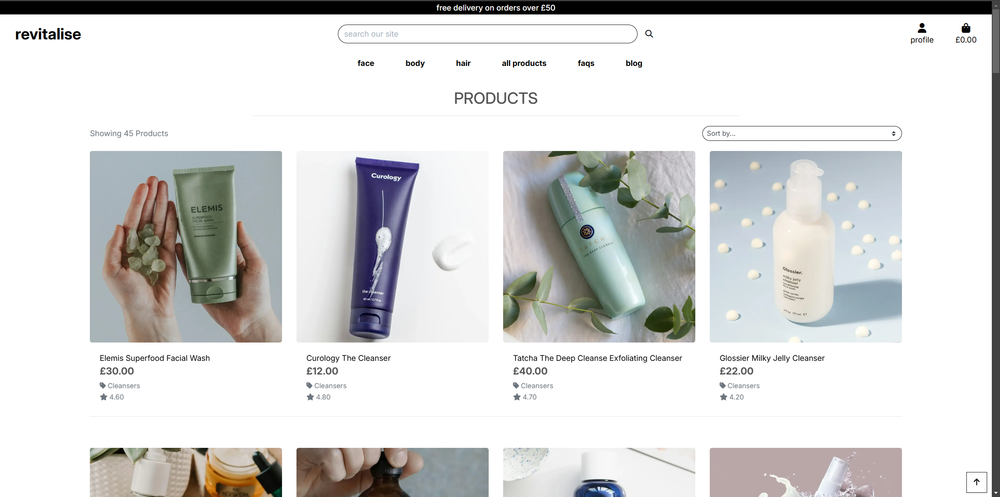
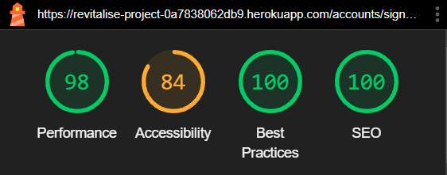
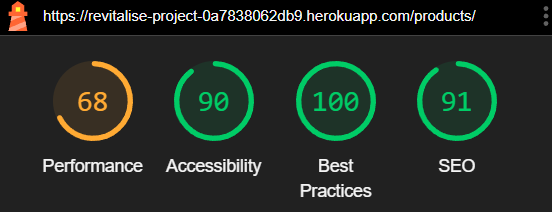
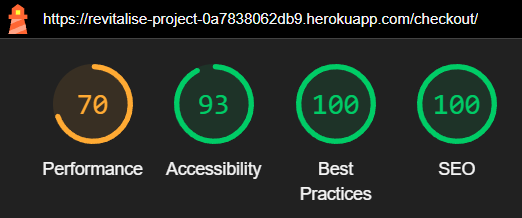

# Milestone Project 4 - Revitalise

## Live Site

The live site for this project can be found at this link: <https://revitalise-project-0a7838062db9.herokuapp.com/>

## GitHub Repository

The GitHub Repository for this project can be found at this link: <https://github.com/99bjacko/milestone-project-4>

## Objective and Initial Concept

In this project, I intend to create an e-commerce site selling cosmetic products, focusing on skincare. The goal of this website is to become a one-stop shop where users can learn about how to care for their skin and also buy products that are proven to keep skin healthy and protected. The main objective is to demonstrate my capabilities using HTML, CSS, JavaScript, and Python with Django along with using relational databases, Stripe payments, and Bootstrap.

The target audience for this website is people who are looking to get into skincare but aren't sure where to start, but this site is also suitable for people who have experience with skincare that are looking to purchase some of the most effective products out there.

## UX

### User Stories

- As a visitor to the website, I want the navigation between pages and/or areas to be easy and intuitive, not having to rely on browser buttons.
- As a visitor to the website, I want the website to be responsive on a number of different devices.
- As a new visitor to the website, I would like the home page to be visually appealing.
- As a new visitor to the website, I want to be able to see a wide range of products.
- As a new visitor to the website, I want to be able to register for an account easily.
- As a new visitor to the website, I would like to make purchases without having to register an account.
- As a visitor to the website, I want there to be an appropriate amount of information about each product.
- As a visitor to the website, I want the checkout process to be smooth and straightforward.
- As a visitor to the website, I want to be able to see exactly what I'm purchasing before completing the checkout process.
- As a visitor to the website, I want to be able to search for specific products and find them easily.
- As a visitor to the website, I want to be able to sort products via price or other parameters.
- As a visitor to the website, I want to be able to view specific product categories and the products that fall under those categories.
- As a returning visitor to the website, I want to be able to log in easily.
- As a returning visitor to the website, I want to be able to log out easily.
- As a returning visitor to the website, I would like to edit the information stored on my profile easily.
- As a returning visitor to the website, I would like to see my previous orders.
- As a site administrator, I would like to be able to add new products.
- As a site administrator, I would like to be able to edit existing products.
- As a site administrator, I would like to be able to delete existing products.
- As a site administrator, I would like to be able to add content such as faqs and blog posts.
- As a site administrator, I would like to be able to edit existing content such as faqs and blog posts.
- As a site administrator, I would like to be able to delete existing content such as faqs and blog posts.

#### Wireframes

For initially designing the project, I utilised Balsamiq to product wireframes. This step allows for planning layouts and page structures, allowing to focus more on the website looking like the designs, instead of trying to simultaneously code and design.

##### Home


##### Sign In


##### Sign Out


##### Profile


##### Products


##### Product Details


##### Bag


##### Checkout


##### Order Confirmation


##### FAQs


##### Blog


#### Colour Scheme

The colour scheme for this project was based around simplicity, to make the aesthetic both simple but appealing, allowing the focus to be on the products and the content, rather than the other aspects around them.
The majority of the website is built around black or grey text on a white background, with use of greys and colours taken from Bootstrap throughout the site where appropriate.

#### Typography

The 'Inter' typeface was chosen for this project and was picked using Google Fonts.

## Features

### Current Features

#### Navigation bar

- The design of the navigation bar is kept consistent across all pages of the website, with the logo on the left hand side, main navigation links and search in the center and profile and bag links on the right.
- On mobile, the main navigation links are contained in a collapsed menu with a navigation toggler, with an additional home link as the logo is hidden.
- There is a delivery banner at the top of the screen promoting free delivery if a customer spends over £50.
- The navigation bar is the main method for navigation around the different pages of the website.
- The main navigation links do not changed whether a user is logged in or not, or if the user is a superuser.
- There are additional links shown to superusers under the profile links to add products, faq posts, and blog posts.

##### Navigation Desktop


##### Navigation Mobile


#### Home Page

- The home page contains a hero image and a call to action button linked to the all products page, encouraging users to shop now.
- The hero image and associated text is fully responsive.


#### Sign In Page

- The sign in page contains a form with a username or email field and a password field.
- Above the form is a paragraph, linking users to sign up if they have not yet created an account.
- There are two buttons, one to take the user back to the home page, and one to sign the user in.
- If the username and password combination cannot be found in the database, a message displays informing the user.
- The form contains basic validation.


#### Sign Up Page

- The sign up page contains a form with email, email confirmation, username, password, and password confirmation fields.
- Above the form is a paragraph, linking users to sign in if they already have an account.
- There are two buttons, one to take the user to the sign in page, and one to sign the user up.
- The form contains basic validation.


#### Profile Page

- The profile page contains two main areas - the default delivery information and the order history.
- The default delivery information can be updated via the profile or when checking out.
- The order history contains past orders, with a link to the order confirmation page.


#### Products Page

- The all products page displays all of the products on the website.
- The main nav links link to products in certain categories.
- The categories selected will appear above the products container.
- Products can be sorted by price, rating, name, and category name.
- Each product has its own card with an image, product name, price, category, and rating.
- The product name and image are links to the product details page of that specific product.
- If a superuser is logged in, each product will have edit and delete buttons on the card.
- Products are stacked on top of each other on mobile, in rows of 2 on tablets, and rows of 4 on desktop.
- There is a back to the top button in the bottom right of the page.




#### Product Details Page

- The product details page displays information on a specific product.
- The product details page for a product is accessed through clicking on the name or image of a product on the products page.
- Each product has an image, product name, price, category, rating, and description.
- The image is shown on the left, with the rest of the content on the right.
- On mobile, the image is shown stacked above the rest of the content.
- There is a quantity selector and a button to add the product to the bag.
- There is also a button to go back to the all products page.
- If a superuser is logged in, each product will have edit and delete buttons, like on the products page.
- Products can be added by admins using the Add Product page.
- Products can be edited by admins using the Edit Product page.


#### Add Product Page

- The add product page can only be accessed by superusers.
- The page contains a form with basic validation.


#### Edit Product Page

- The edit product page can only be accessed by superusers.
- The page contains a prefilled form with basic validation.


#### Shopping Bag Page

- The shopping bag page displays a message if empty and a button to go back to the all products page.
- If there is an item in the bag, its image, name, sku, price, quantity, and subtotal are displayed.
- Beneath the displayed items on desktop, a bag total, delivery cost, and grand total is displayed.
- If the bag total is less than £50, a message is displayed encouraging the customer to spend more to get free delivery.
- There are two buttons displayed, one to go back to the all products page, the other to proceed to the checkout page.
- On mobile, the bag total, delivery cost, grand total, and buttons are displayed above the items in the bag.


#### Checkout Page

- The checkout page is accessed through a button on the shopping bag page.
- The checkout page contains two sections, an order form and an order summary.
- The order form contains fields for name, email address, phone number, address, and a stripe card number field.
- There are two buttons, one to go back to the shopping bag page and one to complete and submit the order.
- If a user is not logged in, above the card field there are links to create an account or login to save the delivery details.
- If a user is logged in, a checkbox is displayed above the card field to save the delivery details.
- The order summary displays the items in the bag with their image, name, quantity, and subtotal.
- Beneath the items, the order total, delivery cost, and grand total are displayed.
- On mobile the order summary is displayed before the order form.
- After successfully placing an order, the user is redirected to an order confirmation page.


#### Order Confirmation Page

- The order confirmation page is accessed after successfully placing an order or viewing a past order through the profile page.
- The order info is displayed, containing a unique order number, and the date and time the order was placed.
- The order details is displayed, showing product names, quantities, and their individual price.
- The delivery details are displayed, showing the information provided in the form.
- The billing info is displayed, containing the order total, delivery cost, and grand total.
- If it is accessed after successfully placing an order, a button is displayed linking to all face products.
- If it is accessed through the profile, a button is displayed linking back to the profile page.


#### FAQs Page

- The FAQs page contains an accordion containing frequently asked questions and relevant answers.
- FAQs can be added by admins using the Add FAQ page.
- FAQs can be edited by admins using the Edit FAQ page.
- If a superuser is logged in, edit and delete buttons are displayed for each FAQ.


#### Add FAQ page

- The add faq page can only be accessed by superusers.
- The page contains a form with basic validation.


#### Edit FAQ page

- The edit faq page can only be accessed by superusers.
- The page contains a prefilled form with basic validation.


#### Blog Page

- The Blog page contains a main heading and cards for each post.
- Each card contains a title, subtitle, date the post was created, and a button linking to the blog post detail page for that specific post.
- Posts can be added by admins using the Add Blog Post page.
- Posts can be edited by admins using the Edit Blog Post page.
- If a superuser is logged in, edit and delete buttons are displayed for each post.


#### Blog Post Details Page

- The blog post details page displays information on a specific post.
- The blog post details page for a post is accessed through clicking on the view post button on the blog page.
- The page displays the post title, subtitle, date it was posted, and content.
- An all posts button linking back to the blog page is displayed beneath the post.
- If a superuser is logged in, edit and delete buttons are displayed for each post.


#### Add Blog Post Page

- The add blog post page can only be accessed by superusers.
- The page contains a form with basic validation.


#### Edit Blog Post page

- The edit blog post page can only be accessed by superusers.
- The page contains a prefilled form with basic validation.


#### Toasts

- Toasts are used throughout the website for actions such as adding an item to the bag, successfully placing an order, editing or deleting a product, and more.


#### Custom Error Pages

- There are custom error pages for 403, 404, and 500 errors.

### Future Features

If I had more time to work on this project, some features I would like to look at are:

- Changing the formats of the dates shown for order confirmations and blog posts.
- Customer reviews and ratings.
- Comments on blog posts.
- Contact form.
- Product page split up into multiple pages.
- More content - the concept of this website is based around lots of good content.

## Technologies Used

- [HTML5](https://en.wikipedia.org/wiki/HTML5) was used to create the website.
- [CSS3](https://en.wikipedia.org/wiki/CSS) was used to style the website.
- [JavaScript (including through Bootstrap)](https://en.wikipedia.org/wiki/JavaScript) was used for the functionality of the website.
- [Python](https://www.python.org/) was used as the back-end programming language for this website.
- [Django](https://www.djangoproject.com/) was used as the Python framework for this website.
- [Bootstrap](https://getbootstrap.com/) was used to aid with responsive design and styling of the website.
- [Gitpod](https://gitpod.io/): used to create the site (IDE).
- [Google Fonts](https://fonts.google.com/): used to import the fonts used for this website into the style.css file.
- [Google Developer Tools](https://developer.chrome.com/docs/devtools/): used for troubleshooting and testing.
- [Git](https://git-scm.com/): used for version control by utilising the Gitpod terminal to commit to Git and push to GitHub.
- [GitHub](https://github.com/): used to save and store the files for the project.
- [Heroku](https://www.heroku.com/): used for hosting the deployed back-end website.
- [Balsamiq](https://balsamiq.com/): used to create the wireframes during the design process.
- [Stripe](https://stripe.com/gb): used for secure online payments in the checkout of this website.
- [AWS S3](https://aws.amazon.com/s3/): used to store static files.
- [Square Image](https://squareanimage.com/): used to crop images.
- [Image Resizer](https://imageresizer.com/): used to resize images.
- [Favicon Generator](https://favicon.io/favicon-generator/): used for website favicon.

## Database

The backend application connects to a Postgres database hosted on [Amazon Web Services](https://aws.amazon.com/free/database/).

### Database Schema

A number of models were created for this website. Below is an Entity Relationship Diagram to visualise the models and the relationships between them.


## Testing

### User Stories Testing

The user stories have been tested and evaluated as shown below:
| User Story | Evaluation | Result |
| ---------- | ---------- | ------ |
| As a visitor to the website, I want the navigation between pages and/or areas to be easy and intuitive, not having to rely on browser buttons. | As a visitor to this website, navigation between page and/or areas is easy and intuitive using the navigation links and buttons where provided | PASS |
| As a visitor to the website, I want the website to be responsive on a number of different devices. | As a visitor to this website, I can see that this website is fully responsive on different devices with different screen sizes, looking appealing on both desktop and mobile devices. | PASS |
| As a new visitor to the website, I would like the home page to be visually appealing. | As a visitor to this website, I believe that the home page is visually appealing and works with the general feel of the website | PASS |
| As a new visitor to the website, I want to be able to see a wide range of products. | As a visitor to this website, I can see that there are many products available from a variety of different categories | PASS |
| As a new visitor to the website, I want to be able to register for an account easily. | As a visitor to this website, I can easily register for my own account by using the sign up page | PASS |
| As a new visitor to the website, I would like to make purchases without having to register an account. | As a visitor to this website, I can complete the checkout process successfully without ever signing up for an account | PASS |
| As a visitor to the website, I want there to be an appropriate amount of information about each product. | As a visitor to this website, I can see that there is a range of data shown for each individual product, and all of the data shown is relevant | PASS |
| As a visitor to the website, I want the checkout process to be smooth and straightforward. | As a visitor to this website, I believe that the checkout process is both easy and quick. | PASS |
| As a visitor to the website, I want to be able to see exactly what I'm purchasing before completing the checkout process. | As a visitor to this website, I can see the items in my bag before navigating to the checkout, and I can also see them on the checkout page itself. | PASS |
| As a visitor to the website, I want to be able to search for specific products and find them easily. | As a visitor to this website, I can easily search for specific products using the search field, or I can look at specific categories to find products.  | PASS |
| As a visitor to the website, I want to be able to sort products via price or other parameters. | As a visitor to this website, I can easily sort products on the product pages by using the sort box | PASS |
| As a visitor to the website, I want to be able to view specific product categories and the products that fall under those categories. | As a visitor to this website, I can use the navigation links to find products under specific categories | PASS |
| As a returning visitor to the website, I want to be able to log in easily. | As a returning visitor, I can easily sign into my account using the sign in page | PASS |
| As a returning visitor to the website, I want to be able to log out easily. | As a returning visitor, I can easily log out of my account by using the logout link, and clicking the sign out button | PASS |
| As a returning visitor to the website, I would like to edit the information stored on my profile easily. | As a returning visitor, I can easily update the default delivery information via the profile page | PASS |
| As a returning visitor to the website, I would like to see my previous orders. | As a returning visitor, I can easily view my previous orders via the profile page | PASS |
| As a site administrator, I would like to be able to add new products. | As a superuser, I can add new products by using the add product page | PASS |
| As a site administrator, I would like to be able to edit existing products. | As a superuser, I can edit existing products by using the edit product page | PASS |
| As a site administrator, I would like to be able to delete existing products. | As a super user, I can delete existing products by using the delete buttons on the products and product details pages | PASS |
| As a site administrator, I would like to be able to add content such as faqs and blog posts. | As a superuser, I can add faqs and blog posts by using the add faq and add blog post pages respectively | PASS |
| As a site administrator, I would like to be able to edit existing content such as faqs and blog posts. | As a superuser, I can edit existing faqs and blog posts by using the edit faq and edit blog post pages respectively | PASS |
| As a site administrator, I would like to be able to delete existing content such as faqs and blog posts. | As a superuser, I can delete existing faqs and blog posts by using the delete buttons on the objects | PASS |

### Manual Testing

| Feature | Expected Outcome | Result |
| ------- | ---------------- | ------ |
| Logo Link | Clicking the logo redirects the user back to the Home Page | PASS |
| Product Category Links | Clicking on a product category link in the navbar displays matching products | PASS |
| Product Search | Searching returns matching products for the query | PASS |
| Product Sort Links | Clicking on a product sort link displays all products sorted by the correct parameter | PASS |
| FAQs Link | User is directed to the FAQs Page | PASS |
| Blog Link | User is directed to the Blog Page | PASS |
| Register Link | Does not show when user is logged in | PASS |
| Register Link | User is directed to the Sign Up Page | PASS |
| Login Link | Does not show up when the user is logged in | PASS |
| Login Link | User is directed to the Sign In Page | PASS |
| Add Product Link | Only shows up for superusers | PASS |
| Add Product Link | Superuser is directed to the Add Product Page | PASS |
| Add FAQ Link | Only shows up for superusers | PASS |
| Add FAQ Link | Superuser is directed to the Add FAQ page | PASS |
| Add Blog Post Link | Only shows up for superusers |
| Add Blog Post Link | Superuser is directed to the Add Blog Post page | PASS |
| Profile Link | Does not show up when the user is not signed in | PASS |
| Profile Link | User is directed to the Profile Page | PASS |
| Logout Link | Does not show up when the user is not signed in | PASS |
| Logout Link | User is directed to the Sign Out Page | PASS |
| Shopping Bag Link | User is directed to the Shopping Bag Page | PASS |
| Shopping Bag | Displays correct grand total when there are no items in the bag | PASS |
| Shopping Bag | Displays correct grand total when there are items in the bag | PASS |
| Home Page Shop Now Button | Links to all products page | PASS |
| Products Page All Products Link | Links to all products page | PASS |
| Products Page Product Count | Shows the correct product count | PASS |
| Products Page Sorting | Selecting a sort parameter sorts the products correctly | PASS |
| Product Details Page Link | Clicking a product name links to the product details page for that product | PASS |
| Product Details Page Link | Clicking a product image links to the product details page for that product | PASS |
| Product Category Link | Clicking a product's category links to all products in that specific category | PASS |
| Product Categories | Selected categories are displayed above the products container | PASS |
| Add Product Page | Allows superuser to add a new product | PASS |
| Edit Product Page | Allows superuser to edit an existing product | PASS |
| Product Edit and Delete Buttons | Only shows up for superusers | PASS |
| Product Edit Button | Links to edit product page for that specific product | PASS |
| Product Delete Button | Deletes the product | PASS |
| Product Details Page | Shows the correct details for the correct product | PASS |
| Product Details Page Category Link | Clicking a product's category links to all products in that specific category | PASS |
| Product Edit and Delete Buttons | Only shows up for superusers | PASS |
| Product Edit Button | Links to edit product page for that specific product | PASS |
| Product Delete Button | Deletes the product | PASS |
| Product Details Page Quantity Selector | Does not decrement past 1 | PASS |
| Product Details Page Quantity Selector | Does not increment past 99 | PASS |
| Product Details Page Keep Shopping Button | Links to all products page | PASS |
| Product Details Page Add To Bag Button | Adds the correct quantity of a product to the bag | PASS |
| Shopping Bag Page | Displays a message when empty | PASS |
| Shopping Bag Page | Shows each item in the shopping bag | PASS |
| Shopping Bag Page | Shows the bag total, delivery cost, and grand total | PASS |
| Shopping Bag Page | If the bag total is less than £50, a message is displayed to encourage the user to spend more to get free delivery | PASS |
| Shopping Bag Page Quantity Selector | Does not decrement past 1 | PASS |
| Shopping Bag Page Quantity Selector | Does not increment past 99 | PASS |
| Shopping Bag Page Quantity Selector | Clicking update updates the quantity to the correct amount | PASS |
| Shopping Bag Page Quantity Selector | Clicking remove removes the item from the bag | PASS |
| Shopping Bag Page Keep Shopping Button | Links to all products page | PASS |
| Shopping Bag Page Secure Checkout Button | Links to checkout page | PASS |
| Checkout Page | Displays order form and correct order summary | PASS |
| Checkout Page Order Form | Details are prefilled if present | PASS |
| Checkout Page Stripe Element | Stripe element is displayed for entry of card details | PASS |
| Checkout Page Adjust Bag Button | Redirects user to shopping bag page | PASS |
| Checkout Page Complete Order Button | Checks that the form is valid and attempts Stripe payment | PASS |
| Checkout Page Success | After successfully checking out, the user is redirected to an order confirmation page | PASS |
| Order Confirmation Page | The correct details are displayed | PASS |
| Order Confirmation Page Button | Links to all face products | PASS |
| Order Confirmation Email | An order confirmation is sent via email to the email inputted in the form | PASS |
| Profile Page | A form for default delivery details is displayed and prefilled if current data exists | PASS |
| Profile Page | Past orders are displayed | PASS |
| Profile Page Order Confirmation | Links to order confirmation page for that previous order | PASS |
| FAQs Page | All FAQs are displayed in an accordion | PASS |
| FAQs Page | Answers are displayed when a FAQ is clicked | PASS |
| Add a FAQ Page | Allows superusers to add a new FAQ | PASS |
| Edit a FAQ Page | Allows superusers to edit an existing FAQ | PASS |
| FAQs Page Edit and Delete Buttons | Only shows up for superusers | PASS |
| FAQ Edit Button | Links to the Edit FAQ page related to that specific FAQ | PASS |
| FAQ Delete Button | Deletes a specific FAQ | PASS |
| Blog Page | All Blog Posts are displayed in an individual cards | PASS |
| Blog Page View Post Link | Links to a specific blog post | PASS |
| Add a Blog Post| Allows superusers to add a new Blog Post | PASS |
| Edit a Blog Post| Allows superusers to edit an existing Blog Post | PASS |
| Blog Page Edit and Delete Buttons | Only shows up for superusers | PASS |
| Blog Page Edit Button | Links to the Edit FAQ page related to that specific FAQ | PASS |
| Blog Page Delete Button | Deletes a specific FAQ | PASS |
| Blog Post Details Page | Shows the correct details for the correct blog post | PASS |
| Blog Post Details Page All Posts Button | Links to blog page | PASS |
| Blog Post Details Edit and Delete Buttons | Only shows up for superusers | PASS |
| Blog Post Details Edit Button | Links to the Edit Blog Post page for that specific post | PASS |
| Blog Post Details Delete Button | Deletes a specific blog post | PASS |
| Favicon | Favicon is displayed in browser tab | PASS |

### Validation

#### HTML Validation using the [W3C Nu HTML Checker](https://validator.w3.org/nu/) (previously W3C Markup Validation Service).

Several pages had minor erros highlighted when using the checker, which were resolved through code refactoring.

#### CSS Validation using the [W3C CSS Validation Service](https://jigsaw.w3.org/css-validator/)

No errors found.

#### JS Validation using [JSHint](https://jshint.com/)

Missing or unnecessary semicolons highlighted, resolved through code refactoring.

#### Python Validation using [CI Python Linter](https://pep8ci.herokuapp.com/) and [Flake8](https://flake8.pycqa.org/en/latest/)

Errors including unnecessary whitespace, lines too long, and indentation errors, all resolved through code refactoring.

### Lighthouse Testing

For this project, I tested the performance, accessibility, best practices and SEO of the website using Lighthouse, one of the Chrome Developer Tools.

| Page | Desktop | Mobile | Notes |
| ---- | ------- | ------ | ----- |
| Home |  |  | Slight performance improvement desired on mobile. |
| Sign In |  |  | Slight accessibility improvement desired on desktop and mobile. Slight performance improvement desired on mobile. |
| Sign Up |  |  | Slight accessibility improvement desired on desktop and mobile. Slight performance improvement desired on mobile. |
| Profile |  |  | Slight accessibility improvement desired on desktop and mobile. Slight performance improvement desired on mobile. |
| Products |  |  | Slight accessibility improvement and performance improvement desired on desktop and mobile. |
| Product Details |  |  | Slight accessibility improvement and performance improvement desired on desktop and mobile. |
| Add Product |  |  | Slight accessibility improvement desired on desktop and mobile. Slight performance improvement desired on mobile. |
| Edit Product |  |  | Slight accessibility improvement desired on desktop and mobile. Performance improvement desired on mobile. |
| Shopping Bag |  |  | Slight performance improvement desired on mobile. |
| Checkout |  |  | Slight accessibility improvement desired on desktop. Performance improvement desired on desktop and mobile. |
| Order Confirmation |  |  | Performance improvement desired on mobile. |
| FAQs |  |  | Slight accessibility improvement desired on desktop and mobile. Performance improvement desired on mobile. |
| Add FAQ |  |  |
Slight performance improvement desired on mobile. |
| Edit FAQ |  |  | Slight performance improvement desired on mobile. |
| Blog |  |  | Slight accessibility improvement desired on desktop and mobile. Performance improvement desired on mobile. |
| Blog Post Details |  |  | Slight accessibility improvement desired on desktop and mobile. Performance improvement desired on mobile. |
| Add Blog Post |  |  | Slight performance improvement desired on mobile.
| Edit Blog Post |  |  | Slight performance improvement desired on mobile.

## Bugs

- Edit and delete buttons were being hidden on smaller screens
    - Altered columns so they were always visible on all screens to superusers.
- Email confirmations were still showing up with example.com as the domain name. This was temporarily fixed after troubleshooting with Tutor Support by changing the SITE_ID to 2 in settings.py. After returning to the project the next day, there were errors about the site not being found. Changed the SITE_ID back to 1 and the issues have been resolved and the email confirmations seem to be working.
- Python 'TypeError' when trying to register a new account on Heroku
    - Included a runtime.txt to specify Python Version 3.9.16 for Heroku to use. This solution was found on Slack.

## Deployment

### Live deployment

The website is deployed on [Heroku](https://www.heroku.com) and can be found [here](https://revitalise-project-0a7838062db9.herokuapp.com/)

### Forking the GitHub Repository

Forking the GitHub repository allows a copy of the original repository to be made without affecting the original repository. This can be achieved by following these steps:

1. Log in to GitHub
2. Navigate to the GitHub repository for this project, milestone-project-3
3. Click the Fork button in the top right corner

### Making a Local Clone

1. Log in to GitHub
2. Navigate to the GitHub repository for this project, milestone-project-3
3. To clone the repository using HTTPS, copy the link under "Clone with HTTPS"
4. Open a GitBash terminal and navigate to the location you want to use for the cloned directory
5. Use the git clone command with the URL copied in Step 3

### Local Deployment

To deploy the project locally, you must either fork or clone this [repository](https://github.com/99bjacko/milestone-project-4).

After forking or cloning the repository, in your IDE:
- Run `pip3 install -r requirements.txt` to install all dependencies
- Create an `env.py` file for storing environment variables. Add this to .gitignore if it isn't already.
- Your env.py should look similar to the one below

```
import os

os.environ.setdefault("SECRET_KEY", "user's secret key")
os.environ.setdefault("STRIPE_PUBLIC_KEY", "user's stripe public key")
os.environ.setdefault("STRIPE_SECRET_KEY", "user's stripe secret key")
os.environ.setdefault("STRIPE_WH_SECRET", "user's stripe webhook signing secret")
os.environ.setdefault("DEVELOPMENT", "True")
```

### Deployment to Heroku

These instructions have been adapted from [Jumpers For Goalposts](https://github.com/nicksmith100/ms4-jumpersforgoalposts)

In order to deploy the project to Heroku successfully, you will need the following:
- A Heroku account.
- A hosted PostgresSQL database, such as one through Amazon Web Services.
- An Amazon Web Services S3 cloud storage account.
- A Stripe account.
- An email account.

Set up the database before attempting the next steps. You will need your database URL.

#### Set up Heroku and connecting your database

1. In Heroku, click on the 'New' button then 'create new app'.
2. Name your app and select the region closest to you.
3. After setting up your app, go to the settings tab and under Config Vars click 'Reveal Config Vars' and add a new variable with the key of `DATABASE_URL` and the value being your database URL.
4. In your IDE, go to settings.py and paste the following code in to your DATABASE section to connect to the new database
```
DATABASES = {
        'default': dj_database_url.parse(os.environ.get('user's database url'))
    }
```
5. In your IDE terminal, type `python3 manage.py showmigrations`. If you are connected, you will see a list of migrations with no ticks next to them.
6. Run `python3 manage.py migrate` to migrate the database structure from your project to the new database. Please note that any data that you have added to the project level SQLite database will not transfer to the new database. You will need to populate the site on the deployed app or use fixtures (JSON files containing database content).
7. Run `python3 manage.py createsuperuser` and follow the instructions to create a superuser.
8. Remove your new database settings from settings.py
9. In your IDE environment variables, add a key of DEVELOPMENT and a value of True.
10. In settings.py, go to the DATABASES section and replace what's currently there with the following
```
if 'DATABASE_URL' in os.environ:
    DATABASES = {
        'default': dj_database_url.parse(os.environ.get('DATABASE_URL'))
    }
else:
    DATABASES = {
        'default': {
            'ENGINE': 'django.db.backends.sqlite3',
            'NAME': os.path.join(BASE_DIR, 'db.sqlite3'),
        }
    }
```
11. Commit and push to GitHub

#### Deploying to Heroku

1. Create a Procfile in your app in the root directory with the following content `web: gunicorn revitalise.wsgi:application` and a blank line at the end.
2. Log in to Heroku using the IDE terminal using the command `Heroku login` and enter your Heroku email and password. (If you have 2 factor authentication set up you will need to use `Heroku login -i` followed by your email and your Heroku API key as the password which you can find in your account settings on Heroku.)
3. Temporarily disable Heroku from collecting static files during deployment using the command `heroku config:set DISABLE_COLLECTSTATIC=1 --app heroku-app-name`
4. Commit and push your changes to GitHub.
5. On the Heroku dashboard, navigate to the Deploy tab and select Github, search for your repository by name and click 'connect'.
6. Go back to the Deploy tab and click on 'Enable Automatic Deploys'.
7. Click 'Deploy Branch'.
8. Once build is complete, your site will be deployed without any of the static files (CSS, JavaScript & Media files).
9. In Heroku settings, scroll down to 'Domains' and copy the 'your app can be found at' URL.
10. In your IDE, go to settings.py and add your deployed site's URL to the ALLOWED_HOSTS list.
11. You now need to replace the Django secret key in your settings.py (if you included it there) with an environment variable to keep it safe. To do this you can use a Django secret key generator online e.g. [djecrety](https://djecrety.ir/), copy the key it provides.
12. Go to your Heroku app's dashboard, open settings and reveal config variables and add a new variable with a key of SECRET_KEY and a value of what you just copied.
13. In your IDE environment variables, add a key of SECRET_KEY and a value of a different Django secret key from your online key generator (djecrety or similar).
14. In settings.py change the SECRET_KEY to `SECRET_KEY = os.environ.get('SECRET_KEY', '')`
15. Below it change the value of DEBUG to the following `DEBUG = 'DEVELOPMENT' in os.environ` to dynamically change whether the app is in DEBUG mode depending on whether it is the development or deployed site.
16. Commit and push your changes to Github.

#### Setting Up Your Static Files on Your Deployed Site using Amazon Web Services (AWS)

1. In your Amazon Web Services S3 account click on 'create bucket' and name it to match your Heroku app, selecting your closest region and uncheck 'block all public access' then click on create bucket to set it up.
2. Click on your new bucket name and go to the properties tab.
3. Scroll to the bottom and click on the edit button by 'Static Website Hosting' and select 'enable', giving default values for the index and error documents (index.html & error.html) then click save changes.
4. Go to the permissions tab and copy the ARN value at the top.
5. Scroll down to the bucket policy section, select 'edit' and 'policy generator'.
6. Select 'S3 bucket policy' from the dropdown.
7. In principles put a * to allow all.
8. Set the action to 'Get Object'.
9. Paste the earlier ARN value in the ARN input.
10. Click on 'add statement' then 'generate policy'
11. Copy the policy text that the generator creates.
12. Back in your bucket settings paste the text in to the Bucket Policy empty text area then add a '/*' to the end of the resource value (which should have your bucket name in it), and click save. This will allow access to all the resources in the bucket.
13. Scroll down to the access control list and grant Read and Write access to Everyone (public access) by checking the boxes.
14. Scroll down to the Cross-Origin Resource Sharing (CORS) section and paste in the following and save:

```
[
    {
        "AllowedHeaders": [
            "Authorization"
        ],
        "AllowedMethods": [
            "GET"
        ],
        "AllowedOrigins": [
            "*"
        ],
        "ExposeHeaders": []
    }
]
```

15. Go back to your AWS dashboard by clicking on the AWS logo at the top left and type in IAM in the search bar and select the IAM service.
16. Click on the user groups tab and create a new group, with the name of your choice, ideally with your app name in it and create the group.
17. Go to the policies tab and create a policy, go the JSON tab and search for the S3FullAccess policy and import it.
18. Edit the policy to the following:
```
{
    "Version": "2012-10-17",
    "Statement": [
        {
            "Effect": "Allow",
            "Action": "s3:*",
            "Resource": [
                "arn:aws:s3:::bucket-name",
                "arn:aws:s3:::bucket-name/*",
            ]
        }
    ]
}
```
19. Click on next and then review.
20. Name the policy and give it a description and then create your policy.
21. Go to the User Groups tab, select your group and go to permissions and click 'add permissions' then 'attach policy' selecting your newly created policy and clicking 'Attach policies'.
22. Create a user for the group by going to the User tab and clicking 'create user'.
23. Name your user (you don't need to select AWS Console access) click next and add your user to your group clicking next as required and 'create user'.
24. Download and save the csv file with the user's credentials - this is important, you will not be able to access this information again.
25. Back in your IDE go to your settings.py file and paste in the following code which tells the app to look for an environment variable called USE_AWS and if it's there to use the following settings to access the static files.
```
if 'USE_AWS' in os.environ:
    # Cache Control
    AWS_S3_OBJECT_PARAMETERS = {
        'Expires': 'Thu, 31 Dec 2099 20:00:00 GMT',
        'CacheControl': 'max-age=94608000'
    }

    # Bucket Config
    AWS_STORAGE_BUCKET_NAME = 'revitalise-project'
    AWS_S3_REGION_NAME = 'eu-north-1'
    AWS_ACCESS_KEY_ID = os.environ.get('AWS_ACCESS_KEY_ID')
    AWS_SECRET_ACCESS_KEY = os.environ.get('AWS_SECRET_ACCESS_KEY')
    AWS_S3_CUSTOM_DOMAIN = f'{AWS_STORAGE_BUCKET_NAME}.s3.amazonaws.com'
```
26. Set up the following config variables in Heroku using the information in the csv file that you downloaded:
  - AWS_ACCESS_KEY_ID: user's access key
  - AWS_SECRET_ACCESS_KEY: user's secret access key
  - USE_AWS: True
27. Remove COLLECTSTATIC from the config variables in Heroku
28. Back in your IDE create a file called custom_storages.py in the root directory and add the following:
```
from django.conf import settings
from storages.backends.s3boto3 import S3Boto3Storage


class StaticStorage(S3Boto3Storage):
    location = settings.STATICFILES_LOCATION


class MediaStorage(S3Boto3Storage):
    location = settings.MEDIAFILES_LOCATION

```
29. In settings.py add the following to tell it to look for the new storage classes we just created in custom_storages and to override the URLS for static and media files. Put this just below the AWS code from earlier within the if `'USE_AWS' in os.environ` statement.

```
# Static and media files
STATICFILES_STORAGE = 'custom_storages.StaticStorage'
STATICFILES_LOCATION = 'static'
DEFAULT_FILE_STORAGE = 'custom_storages.MediaStorage'
MEDIAFILES_LOCATION = 'media'

# Override static and media URLs in production
STATIC_URL = f'https://{AWS_S3_CUSTOM_DOMAIN}/{STATICFILES_LOCATION}/'
MEDIA_URL = f'https://{AWS_S3_CUSTOM_DOMAIN}/{MEDIAFILES_LOCATION}/'

```

30. Save your settings.py then push to push your changes to GitHub.
31. Once the deployment has finished check your S3 bucket, there should be a static folder in there with your static files (CSS / JS folders with files inside) and the live site should now have its CSS styling and any JavaScript functionality.
32. Finally to add your media files simply go back to AWS, create a new folder called 'media' in the same place as the new 'static' folder, click on the folder and drag and drop all your media files in to the browser window.
33. Click next and under manage public permissions select 'grant public access to these objects' and click upload.
34. Your site should now contain all your media and static files.

#### Setting up Stripe Payments on your deployed site

1. Log in to Stripe, browse to the [API keys](https://dashboard.stripe.com/test/apikeys) tab and copy the API key and set them in Heroku as config variables in the following:

- STRIPE_PUBLIC_KEY: Stripe public key goes here
- STRIPE_SECRET_KEY: Stripe secret key goes here

2. Back in Stripe set up a new webhook for your deployed site by clicking on webhooks, click on 'add endpoint', paste in your deployed site's URL and add '/checkout/wh/' at the end of it. Set it to listen for all events.
3. Click on your newly set up webhook and click on 'Signing Secret' at the top to reveal the secret value. Copy it and set it as a new config variable in Heroku:
- STRIPE_WH_SECRET: Signing secret from new webhook.

#### Setting up emails on your deployed site

1. With your chosen email provider, set up an "app password". Note this is different to your standard account password, and is specifically to allow external apps to send emails from your account.
2. In Heroku add the following config variables:
- EMAIL_HOST: Your email host SMTP settings
- EMAIL_HOST_USER: Your email address
- EMAIL_HOST_PASSWORD: Your app password

#### Checking Heroku config variables

Having followed all of the above steps you should see the following config variables in your Heroku settings:

  | Key | Value |
  | :---: | :---: |
  | AWS_ACCESS_KEY_ID | _AWS Access Key_ (from the CSV file downloaded from your AWS S3 account) |
  | AWS_SECRET_ACCESS_KEY | _Secret Access Key_ (from the CSV file downloaded from your AWS S3 account) |
  | USE_AWS | True |
  | DATABASE_URL | _Database URL_ (from your database settings)  |
  | EMAIL_HOST | _Email SMTP host_ (from your email account)|
  | EMAIL_HOST_PASSWORD | _Email app password_ (from your email account) |
  | EMAIL_HOST_USER | _Email address_ (from your email account) |
  | SECRET_KEY | _Secret Key_ (a generated Django secret key, e.g. using [djecrety](https://djecrety.ir/)) |
  | STRIPE_PUBLIC_KEY | _Stripe Public Key_ (from your Stripe account - API keys) |
  | STRIPE_SECRET_KEY | _Stripe Secret Key_ (from your Stripe account - API keys)|
  | STRIPE_WH_SECRET | _Stripe Webhook Secret_ (from your Stripe account - Webhooks) | 


## Credits

### Code

- [Boutique Ado](https://github.com/Code-Institute-Solutions/boutique_ado_v1/)

### Content

- [Nick Smith](https://github.com/nicksmith100), [Emma Hewson](https://github.com/emmahewson): Heroku deployment instructions.
- [Unsplash](https://unsplash.com/): Used for product images and background image
- [Pexels](https://www.pexels.com/): Used for product images

### Acknowledgements

- Code Institute for all course material
- Code Institute Tutor Support team for assistance and guidance
- Code Institute Slack community for assistance and guidance
- My mentor, Rahul, and my cohort facilitators, Amy and Lewis, for providing feedback and encouragement throughout the process.